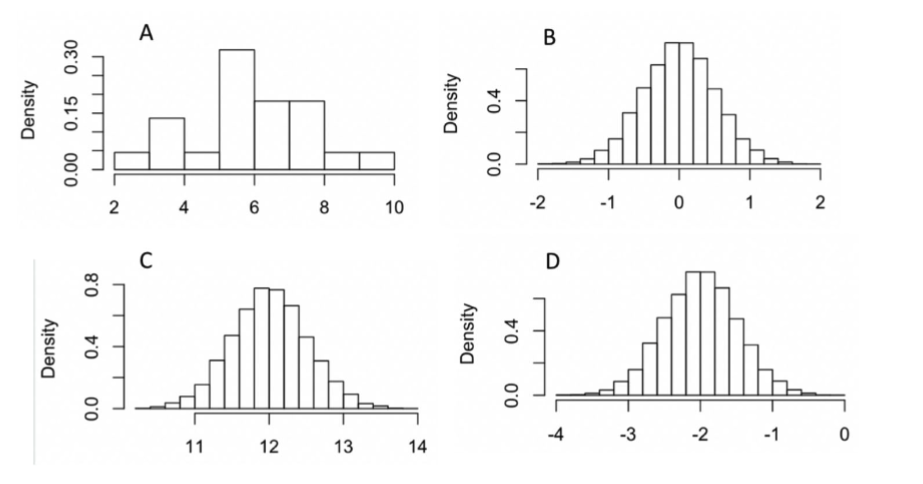

**Please download the Discussion 8 materials.**

```{r, echo = FALSE, warnings = FALSE, message = FALSE}
library(knitr)
library(tidyverse)
```

## Warmup

Work on the Week 9 Quiz question 6 with your neighbor.

Suppose we are drawing a sample of size $10$ from a population $X$ that is normally distributed with mean $5$ and variance $1$. 
We are drawing a second sample of size $15$ from a population $Y$ that is normally distributed with mean $7$ and variance $2$. 
Which of the following histograms displays the sampling distribution for $\bar{X} - \bar{Y}$ 
(You may need to revisit the slides in Notes 4 that discuss the properties of expectation and variance for combining variables)


```{r, out.width = "110%", echo = FALSE}

```

\newpage

## Hypothesis Testing for a Population Mean

**Exercise 1.** A crop scientist evaluating lettuce yields plants 20 plots, treats them with a new fertilizer, lets the lettuce grow, and then measures yield in numbers of heads of lettuce per plot, with these results:

144, 151, 148, 146, 156, 154, 142, 155, 150, 146, 153, 151, 150, 156, 150, 152, 149, 158, 147, 151

The data is also given in the file `lettuce.csv`. The old fertilizer led to an average yield of 145 heads per plot. Test whether the fields this year with the new fertilizer appears to have higher yield via the following steps.

> a. Write hypotheses for the question of interest regarding $\mu$, the average number of lettuce heads per plot under these planting conditions with the new fertilizer. Carefully consider the scientist's question and the direction of the effect they are trying to detect.


> b. We do not have any information about the distribution of number of heads of lettuce per plot. So, produce the appropriate graphs to determine what hypothesis tests are reasonable to consider performing. 

```{r}
lettuce <- c(144, 151, 148, 146, 156, 154, 142, 155, 150, 146, 
             153, 151, 150, 156, 150, 152, 149, 158, 147, 151)
```


> c. Perform a t test at the significance level $\alpha=0.10$ after stating the assumptions you are using.  Try to get the same t-test results both by hand and with `t.test`.

> d. The crop scientist ran a power analysis (using Z test statistic) before collecting data to ensure a sample size of 20 would have high power to reject the null in favor of the alternative if the new mean numbers of heads per plot was $\mu_A=150$ since an increase in 5 heads per plot on average was very desirable to detect. 

>> Calculate the approximate power of a Z test at the significance level $\alpha=0.10$, assuming $\sigma=5$. Draw graphs of the null and alternative distributions of $\bar{X}$ and be sure you can identify which areas correspond to Type 1 Error Rate:$\alpha$, Type 2 Error Rate: $\beta$, and Power: $1-\beta$.

> e. The crop scientist is considering two study designs, shown below. Discuss the benefits and limitations of each.

Design 1: planting and comparing 10 plots that use the old fertilizer and 10 that use the new this year

Design 2: comparing the 20 plots with new fertilizer this year to the average from last year

\newpage

A crop scientist evaluating lettuce yields plants 20 plots, treats them with a new fertilizer, lets the lettuce grow, and then measures yield in numbers of heads of lettuce per plot, with these results:

144, 151, 148, 146, 156, 154, 142, 155, 150, 146, 153, 151, 150, 156, 150, 152, 149, 158, 147, 151

The data is also given in the file `lettuce.csv`. The old fertilizer led to an average yield of 145 heads per plot. Test whether the fields this year with the new fertilizer appears to have higher yield via the following steps.

### 1(a)

Write hypotheses for the question of interest regarding $\mu$, the average number of lettuce heads per plot under these planting conditions with the new fertilizer. Carefully consider the scientist's question and the direction of the effect they are trying to detect.

$H_A: \mu > 145$ and $H_0: \mu \leq 145$, where $\mu$ is the average number of lettuce heads per plot under these planting conditions with the new fertilizer.


### 1(b)

We do not have any information about the distribution of number of heads of lettuce per plot. So, produce the appropriate graphs to determine what hypothesis tests are reasonable to consider performing. 

```{r}
lettuce <- c(144, 151, 148, 146, 156, 154, 142, 155, 150, 146, 
             153, 151, 150, 156, 150, 152, 149, 158, 147, 151)
```

**One sample inferential tests**

<!-- Talk about Z and t test. The main difference here is whether pop SD is known. Only t is possible -->
<!-- For t, either normal or N >= 30. as N = 20, need to check normality -->

```{r}
length(lettuce)
```

\newpage

```{r, out.width = "50%"}
par(mfrow = c(1, 2))
hist(lettuce)
qqnorm(lettuce); qqline(lettuce)
```


### 1(c) 

Perform a t test at the significance level $\alpha=0.10$ after stating the assumptions you are using.  Try to get the same t-test results both by hand and with `t.test`.

**Assumptions**

* Assume our population is normal.
* Assume we have independent observations from the population.


```{r}
t.test(lettuce, mu = 145, alternative = "greater")
```
\newpage

**test statistic**

$$t = \frac{\bar{X} - \mu_0}{\frac{S}{\sqrt{n}}}.$$
```{r}
length(lettuce); mean(lettuce); sd(lettuce)
```

* $\bar{X}$: sample mean, is $150.45$.
* $\mu_0$: in our hypothesis, is $145$.
* $S$: sample SD, is $4.198684$.
* $n$: sample size, is $20$.

\begin{align*}
  t &= \frac{\bar{X} - \mu_0}{\frac{S}{\sqrt{n}}} \\
    &= \frac{150.45 - 145}{4.198684 / \sqrt{20}} \\
    & = 5.804948
\end{align*}

**p value**

$df = n-1 = 19$

The p-value is $P(t_{19}>5.804948$.

```{r}
1 - pt(5.804948, 19)
```

```{r}
t.test(lettuce, mu = 145, alternative = "greater")
```

### 1(d)

The crop scientist ran a power analysis (using Z test statistic) before collecting data to ensure a sample size of 20 would have high power to reject the null in favor of the alternative if the new mean numbers of heads per plot was $\mu_A=150$ since an increase in 5 heads per plot on average was very desirable to detect. 

Calculate the approximate power of a Z test at the significance level $\alpha=0.10$, assuming $\sigma=5$. Draw graphs of the null and alternative distributions of $\bar{X}$ and be sure you can identify which areas correspond to Type 1 Error Rate:$\alpha$, Type 2 Error Rate: $\beta$, and Power: $1-\beta$.

**Step 1: find the rejection regime.**

$H_A: \mu > 145$ and $H_0: \mu \leq 145$. If we are using a Z test with $\alpha=0.10$, $\sigma=5$, and $n = 20$, the test statistic

$$Z = \frac{\bar{X} - \mu_0}{\frac{\sigma}{\sqrt{n}}} = \frac{\bar{X} - 145}{5/\sqrt{20}}.$$

```{r}
qnorm(1-0.1)
```

When $Z\geq Z_{critical} = 1.281552$, we would reject $H_0$. That is equivalent to 

$$\bar{X}\geq 1.281552 * (5/\sqrt{20}) + 145 = 146.4328.$$
**Step 2: compute the probability of rejecting $H_0$.**

If the new mean numbers of heads per plot was $\mu_A=150$, $\bar{X} = N(150, (\frac{5}{\sqrt{20}})^2).$

$$\text{Power} = P(\text{reject }H_0|\mu_A = 150) = P(\bar{X}\geq 146.4328).$$
```{r}
1 - pnorm(146.4328, 150, 5/sqrt(20))
```


If in fact the true mean number of lettuce heads per plot is $150$ (and $n=20$ is large enough for CLT or the population is normal, and $\sigma = 5$), then we have a $99.9\%$ chance of getting a sample that will give us strong enough evidence to reject the null.

\newpage

### 1(e)

The crop scientist is considering two study designs, shown below. Discuss the benefits and limitations of each.

Design 1: planting and comparing 10 plots that use the old fertilizer and 10 that use the new this year

Design 2: comparing the 20 plots with new fertilizer this year to the average from last year


With Design 1, both treatments exist with the same environmental effects such as rain levels, sunshine hours, previous soil conditions, etc, so differences in the mean lettuce count between the two treatments can be more clearly connected to the different in fertilizer; this is not true with Design 2.

With Design 2 we have more plots allocated to the new fertilizer, so we have more information about the average performance and how much that performance varies.

(The analysis regarding the results under Design 1 will be learned in the future.)